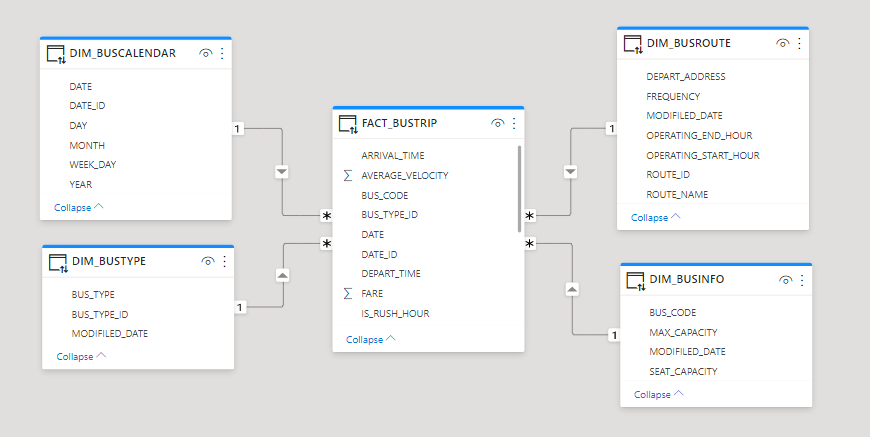
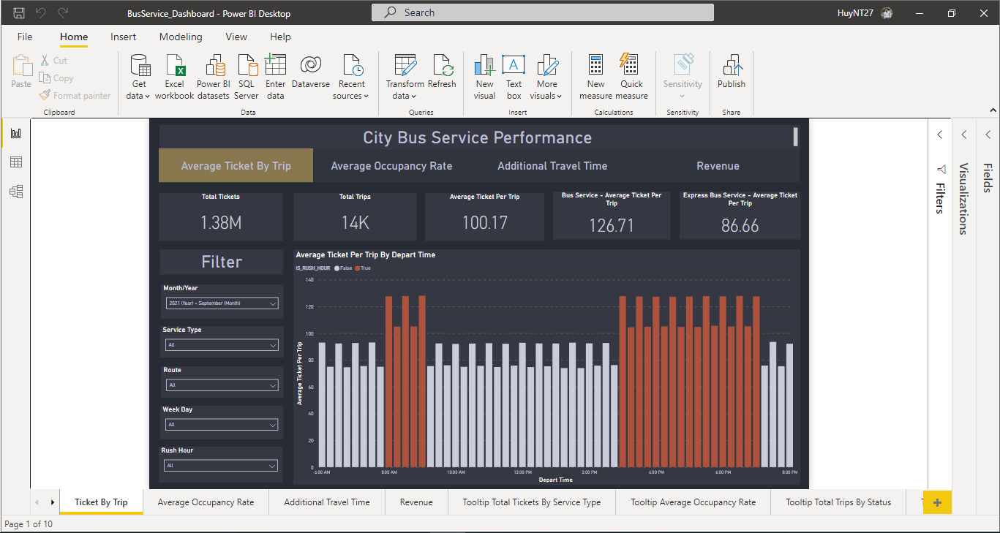

# Public Transportation Data Pipeline

### Decsription of this project

Allocate resource and scheduling based on route, traffic, transport type information.

### Purpose

Building the data pipeline.

## :bus: Detail of Work
1. Generate data and create project folders
    - Run python file in `resources/data-generator.py`. It will create fake data and project folders in `C:\Users\<user-name>\project`
2. Design data pipeline 
    
3. Build data model
    - Schema
    
    
    - Dimensional model
    
4. Ingest data, Extract and Load into Data warehouse
    - The flat files data first go into the staging area, where preprocessing with SSIS and put to MSSQL.
5. Load data onto Snowflake using snowsql
    - The SSIS will execute `snowPut.bat` in project folder to run `put` command on Snowflake (load data to the internal stage on Snowflake).
    - After uploading into internal stage successfully, defined tasks on snowflake will load data from internal stage to destination table on schedule.
6. Visualize your data
    - Data on the dimensional tables is visualized on the Power BI dashboard.



## :rocket: Getting Started
### Prerequisites
- Install [Snowsql](https://docs.snowflake.com/en/user-guide/snowsql.html) and add the following setting to `config` file (Windows: `config` file located at `C:\Users\<user-name>\.snowsql`): 
    ```
    [connections.snowflakeConnection]
    accountname = <accountname> # Ask the repo owner for the accountname
    username = <username> # Ask the repo owner for the username
    password = <password> # Ask the repo owner for the password
    ```
- Install [Python](https://www.python.org/)

    Window 10, opeing Window Store, search `python` keyword and install python 3.9 
- Clone the repo:
    ```
    git clone https://github.com/dhuy237/fa-project-1-team-7.git
    git switch g6-revise-project
    ```

### Usage
1. Generate data: `python resources/data-generator.py`
2. Login into MSSQL and run [init_mssql.sql](./src/mssql/init_mssql.sql)
3. Authen SnowSQL and run [init_snowflake.sql](./src/snowflake/init_snowfalke.sql)
4. Unzip [project1_team7_FA_SSIS_Revise.7z](./src/project1_team7_FA_SSIS_Revise.7z) and open file `project1_team7_FA.sln` using Visual Studio
5. Deloy [SSIS package on SQL Server](https://www.c-sharpcorner.com/article/deploy-ssis-package-to-sql-server/):
    - After deploying by Visual Studio successfully
    - Open project folder in `Integration Services Catalogs\SSISDB`
    - Open `Environments` folder and set up 2 variables Database(PublicTransportation) and ServerName(your servername). [Read more](https://www.mssqltips.com/sqlservertip/4810/setup-environment-variables-in-sql-server-integration-services/)
    - Configure project with 2 above enviroments.
    - Expand project folder, right-click on package you want to execute and choose `execute`
## :round_pushpin: Roadmap

See the [open issues](https://github.com/dhuy237/fa-project-1-team-7/issues) for a list of proposed features (and known issues).

## :hammer: Contributing

Contributions are what make the open source community such an amazing place to be learn, inspire, and create. Any contributions you make are **greatly appreciated**.

1. Fork the Project.
2. Create your Feature Branch (`git checkout -b feature/Feature`).
3. Commit your Changes (`git commit -m 'Add some feature'`).
4. Push to the Branch (`git push origin feature/Feature`).
5. Open a Pull Request.

## :mailbox: Contact
- Huy Tran ([dhuy237](https://github.com/dhuy237)) - d.huy723@gmail.com
- Quyen Mai ([mtquyen](https://github.com/mtquyen)) - maithiquyen124@gmail.com
- Huy Nguyen ([huynguyen314](https://github.com/huynguyen314)) - thanhhuya10lk@gmail.com
- Linh Thieu ([thieukhanhlinh](https://github.com/thieukhanhlinh)) - novemberlinh@gmail.com
